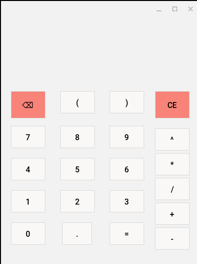

# Modern Tkinter Calculator Parser & Tokenizer

This is a modern parser & tokenizer engine powered by Python's Tkinter library. Some core features of the calculator include the 
ability to parse expressions that otherwise would have been erroneous in the base-10 system like "0.1 + 0.2" which equals 0.3, 
not 0.30000000004. It runs with zero external dependencies, ensuring that you don't have to install third party software just
to run it. It avoids dangerous functions such as eval() and exec() to prevent dangerous malicious input directly onto the calculator's
interface.

It supports binding operations such as the **Enter** key on your keyboard to get the result of an expression. It runs with completely
stripped telemetry: no data logs/usage statistics will be sent to external servers.

## Requirements

1. Python 3 on your system.
   
2. Device terminal if not on Windows. Powershell if on Microsoft Windows.

3. The chosen choice of your terminal must be on to avoid closing the calculator gui. However, you can use nohup command on Linux
   to avoid having your chosen terminal and calculator open at the same time and just have the calculator open.

## Interface

- The middle column is reserved for the numberpad.

- The furthest right column is reserved for the operator.

- The upper middle row is reserved for operations involving parentheses.

- The upper row/left column is reserved for deleting space to correct typign errors.

- The upper row/right column is reserved for deleting the **Entire** expression from the entry pad.
  Only do this if you have made several errors.

## License

This parser & tokenizer calculator is published under the [MIT License](https://mit-license.org/).

## Final remarks

This custom parser & tokenizer project took me 7-9 weeks to build, and my purpose in building this project is to avoid future
beginners from using eval() and exec() when building similar calculator projects. Funnily enough, I was so **close** to using
eval() in my project, but I knew that would be catastrophic to the security of the calculator.

It would be bad news when someone with bad intentions could type dangerous queries and delete all files from the host's computer.
Before I knew about the security risks, I personally asked DeepSeek for projects that would challenge me toward the
end of the 2026 spring semester in my university's CS1 class. DeepSeek challenged me to create a calculator for a fake bookstore
client for "Maggie Chen" who needed a reliable calculator for offline use when dangerous weather came. I thought reliable meant
a calculator that doesn't include complex operations like sin, cos or tan. However: I was fooled by the difference the AI thought
it took to complete and how long it took me to understand how Tkinter worked.

At the time, I never used Tkinter in my entire life. But: instead of watching hours of YouTube tutorials, I knew that the best ROI
was going to come through reading Python documentation and not using artificial intelligence as a crutch to understand syntax for me.
I know syntax is quickly becoming a commodity, but the ability to think and decipher wasn't going to be commoditized anytime soon.

At that point: I knew that relying on quick fixes was going to make me a proficient programmer in my stage of learning. So: I made
a quick detour and learning about the Pratt parsing and Shunting yard algorithms. These algorithms looked complex to me at the time,
so I volunteered to create my own algorithm for parsing and tokenizing expressions to understand how these low level and hard to read
structures actually worked under the hood.

After 7-9 grueling weeks, I can finally say that the project is mostly finished, and I will invite anyone who stumbles on the project
to submit pull requests or issues if you see any obvious flaws with the calculator.

Thank you sincerely,

Omar

   

